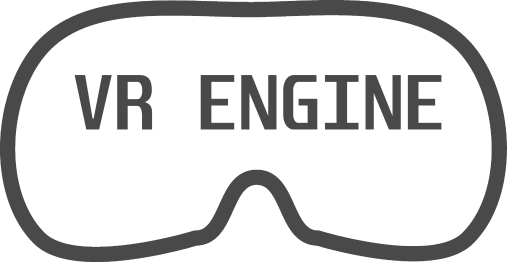

# 

     

VREngine is a Unreal Engine plugin that lets you easily create VR projects. It provides all the necessary ground work so you can focus more on the game rather than creating basic VR things like movement and item pickup.

## Motivation

VREngine was developed as a side project for one of my games I made at college. The main idea was to create a plugin containing all the essential tools for me to create more VR games later on without needing to code everything again.

## Main Features

   
<h2 align="center">Item Pickup and Drop</h2>

   

<h2 align="center">Full body rig (IK) with Valve Index Support</h2>

   

<h2 align="center">Fully Customisable</h2>

   

<h2 align="center">Full Item Physics</h2>

## Example Project

An example project for Unreal Engine can be found [here](https://github.com/Jordonbc/VREngine-template). You should be able to change engine version if you change the plugin files to the appropriate branch.
## Code

Everything in the plugin is written in C++, no blueprints here.

You can use blueprints if you don't like coding in C++ the functions will be listed on the wiki.

## Tech/Frameworks used

Built with:

- Unreal Engine
- OpenXR

## Installation

### Using precompiled dlls

Once you download the zip file extract it and either place the extracted folder in the Plugins folder of your game or in the engine plugin folder for global use.

### Building from Source

If you build VREngine from source you must place this repository in a folder called Plugins in the base directory of your game where the .uproject lives e.g. mygame/Plugins/VREngine

## API Reference

You can use the Wiki to find information about all the functions.

## VREngine Plugins

VREngine is setup in a way that allows users to make plugins that can be used the extend the functionality of VREngine.

- [VR Guns](https://github.com/Jordonbc/VREngineGuns)

## Disclaimer

This plugin contains content used from the 3rd person character template Epic Games provides e.g. Mannequin. This is to be used as a placeholder and testing purposes and should not be used in production as stated in the [marketplace guidelines under 2.1.e](https://www.unrealengine.com/en-US/marketplace-guidelines#21e).

## License

This project is licensed under the [Apache License 2.0](https://github.com/Jordonbc/VREngine/blob/master/license)

Apache License 2.0 © Jordon Brooks

If you use this plugin in your games, please consider helping me out by sponsoring 🙏
